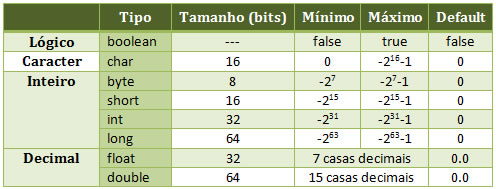

<p align="center">
   
  
</p>

<p align="center">
  &nbsp;

  <a href="https://www.linkedin.com/in/nlnadialigia/">
  
  </a>&nbsp;
  <a href="mailto:nlnadialigia@gmail.com">
    
  </a>&nbsp;
  
</p>

<br>

# Índice

- [Iniciando um Projeto Java](#📌-iniciando-um-projeto-java)
- [Tipos primitivos, wrappers, não primitivos e tipagem forte e estática](#📌-tipos-primitivos-wrappers-não-primitivos-e-tipagem-forte-e-estática)
- [Modificadores de acesso](#📌-modificadores-de-acesso)
- [Métodos abstratos, default e herança múltipla](#📌-métodos-abstratos-default-e-herança-múltipla)

<br>

## 📌 Iniciando um Projeto Java

---

### Classes

- todo programa tem que rodar em cima de uma classe
- toda classe tem que ter um nome
- as classes começam com letra maiúscula
- método principal:

  ```java
  public static void main(String[]args) {
    System.out. println("Hello world")
  }
  ```

- **Composição**
  - Main
  - Atributos ⇒ características da classe
  - Métodos
    - Retornos
    - Parâmetros
    - Assinatura
  - Construtores ⇒ método particular que leva o mesmo nome da classe e fala como a classe será construída quando for instanciar um objeto

## 📌 Tipos primitivos, wrappers, não primitivos e tipagem forte e estática

---

### Primitivos

- divididos em grupos
- não podem ser nulos
- possuem valores default
- podem não ser inicializados, mas não poderão ser utilizados



### Wrappers

- são objets que representam os tipos primitivos
- Auto-boxing e Unboxing
- Possuem métodos que facilitam ⇒ auto-boxing
  - pode atribuir um valor nulo
  - pode atribuir boolean de uma string
- Unboxing ⇒ dada uma classe é possível atribuir a um tipo primitivo

### Não Primitvos

- String ⇒ sequêcia de caracteres
- Number
- Object ⇒ objeto principal do Java ⇒ todos os outros objetos estendem o Object
- Qualquer outros objetos
- Exceto os tipos primitivos, todos os tipos são um objeto

### Tipagem forte e estática

- Forte e estática
- var - Inferência de tipo ⇒ assim o próprio compilador já sabe qual é o tipo
- Uma tipagem estática significa que os tipos das variáveis são verificados no tempo da compilação
- Uma tipagem forte significa que um vez que foi atribuído um tipo para a variável não é possível mudar

## 📌 Modificadores de acesso

---

### public

- public pode ser acessada de qualquer lugar por qualquer entidade que possa visualizar a classe a que ela pertence.

### private

- os métodos e atributos da classe definidos como privados não podem ser acessados ou usados por nenhuma outra classe. Esses atributos e métodos também não podem ser visualizados pelas classes herdadas.

### protected

- torna o membro acessível às classes do mesmo pacote ou através de herança, seus membros herdados não são acessíveis a outras classes fora do pacote em que forem declarados.

### default(padrão)

- a classe e/ou seus membros são acessíveis somente por classes do mesmo pacote, na sua declaração não é definido nenhum tipo de modificador, sendo este identificado pelo compilador.

### abstract

- não é aplicado nas variáveis, apenas em classes e métodos. Uma classe abstrata não pode ser instanciada. Se houver alguma declaração de um método como abstract, a classe também deve ser marcada como abstract.

### static

- é usado para a criação de uma variável que poderá ser acessada por todas as instâncias de objetos desta classe como uma variável comum, ou seja, a variável criada será a mesma em todas as instâncias e quando seu conteúdo é modificado numa das instâncias, a modificação ocorre em todas as demais. E nas declarações de métodos ajudam no acesso direto à classe, portanto não é necessário instanciar um objeto para acessar o método.

### final

- quando é aplicado na classe, não permite estender, nos métodos impede que o mesmo seja sobrescrito na subclasse, e nos valores de variáveis não pode ser alterado depois que já tenha sido atribuído um valor.

## 📌 Métodos abstratos, default e herança múltipla

---

### Interfaces

- **Métodos abstratos**
  - devem ser implementados por todos
  - novos métodos quebram as implementações
- **Métodos default**
  - são herdados a todos que implementam
  - novos métodos não quebram as implementações
- **Herança múltipla**
  - quando um método default for igual para 2 interfaces é obrigatória a implementação do mesmo

### Enums

- dicionários de dados imutável
- não é permitido criar novas instâncias
- o construtor é sempre declarado como private
- por convenção, por serem objetos constantes e imutáveis (static final), os nomes são em MAIÚSCULOS.
- pode ter atributos agregados a eles

---
