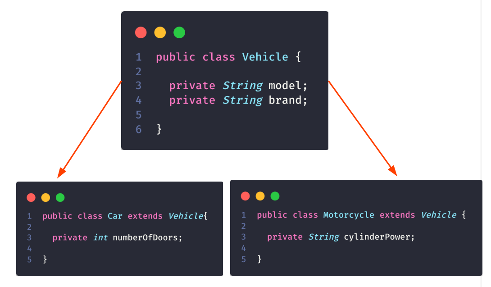

<p align="center">
   
</p>

<p align="center">
  &nbsp;

  <a href="https://www.linkedin.com/in/nlnadialigia/">
  
  </a>&nbsp;
  <a href="mailto:nlnadialigia@gmail.com">
    
  </a>&nbsp;
  
</p>

<br>

# Índice

- [O Paradigma de Orientação a Objetos](#📌-o-paradigma-de-orientação-a-objetos)
- [Construtores](#📌-construtores)
- [Encapsulamento, Herança e Polimorfismo](#📌-encapsulamento-herança-e-polimorfismo)
  - [Encapsulamento](#📎-encapsulamento)
  - [Herança](#📎-herança)
  - [Polimorfismo](#📎-polimorfismo)
- [Aprenda as características específicas em orientação a objetos](#📌-aprenda-as-características-específicas-em-orientação-a-objetos)
  - [This](#📎-this)
  - [Super](#📎-super)
  - [Equals](#📎-equals)
  - [HashCode](#📎-hashCode)

<br>

## 📌 O Paradigma de Orientação a Objetos

> "A programação Orientada a Objetos impõe disciplina sobre a transferência indireta do Controle" - Robert "Uncle Bob" Martin - Livro Arquitetura Limpa

<br>

> "... a pilha de chamada funções... poderia ser movida para HEAP (área de memória não necessariamente ordenada - diferente da stack) possibilitando que as variáveis locais declaradas por uma função existissem muito depois que a função retornasse..." - Robert "Uncle Bob" Martin - Livro Arquitetura Limpa

<br>

> "A diferença entre um Código Procedural e um O.O é bem simples. Em códigos procedurais (...) escolher o melhor algoritmo é o mais importante (...) Já em linguagens orientado a objetos (...) pensar no projeto (...) como se encaixam (...) e como serão estendidas é o que mais importa." - Maurício Aniche - Livro Orientação a Objetos e SOLID para Ninjas

<br>

### 📎 Classe

- Vamos entender uma classe como modelo a ser seguido.
- Uma classe vai funcionar como uma espécie de molde que nos servirá como base para construir algo.
- Por exemplo. Quando pensamos em construir uma casa, nós fazemos uma planta baixa. Ela será o modelo que utilizaremos para construir algo concreto.
- As classes funcionam de forma parecida.

  ```java
  public class Pessoa {

    private String name = "Ana";

    public String getName() {
      return name;
    }
  }
  ```

<br>

### 📎 Objeto

- Agora que entendemos que temos um modelo que podemos seguir, O que podemos fazer com esse modelo?
- Bom.. Nós fizemos a analogia da casa, certo ?
- Depois de termos a planta baixa, nós começamos a construir.
- E o resultado do que nós construímos, vamos chamar de objeto.
- Quando nós utilizamos a nossa classe Pessoa - mostrada no código anterior - para criar um objeto, nós diremos que estamos **instanciando um objeto da classe Pessoa.**
- E esse termo é bem simples de entender. O que acontece é que podemos criar vários objetos de uma mesma classe, ou seja, várias **instâncias de objetos.**

  ```java
  public class InstanciaObjeto {

    public static void main(String[] args) {

      Pessoa person = new Pessoa();

      System.out.println(person.getName()); //Ana
    }
  }
  ```

<br>

### 📎 Atributos

- Agora vamos pensar no que nos definimos como nome. Foi tão intuitivo nós pensarmos que uma pessoa teria um nome que nem demos importância a ele.
- O nome é uma característica de uma Pessoa e pode ser diferente de pessoa para pessoa.
- O nome é um atributo da pessoa.

### 📎 Métodos

- Agora vamos pensar que uma pessoa pode ter ações. Por exemplo, uma pessoa pode falar.
- Pensando em um cenário mais específico, uma pessoa pode falar o seu nome.
- As ações que nós definimos que uma classe pode ter, nós chamamos de métodos.

  ```java
  public class Method {

    public static void main(String[] args) {

      Pessoa person = new Pessoa();

      System.out.println(person.sayMyName());

      System.out.println(person.walk());
    }
  }
  ```

<br>

## 📌 Construtores

- Podemos entender o termo **construtor** no sentido literal, afinal vamos **construir um objeto**.
- Por meio de um construtor, **criamos um objeto** baseado em uma Classe e assim o alocamos em memória.
- Ao criarmos um objeto dizemos que estamos **instanciando um objeto**.

  ```java
  public class Pessoa {

    private String name;

    public String getName() {
      return name;
    }

    public void setName(String name) {
      this.name = name;
    }
  }
  ```

- Esse exemplo que acabamos de ver é o exemplo mais comum quando começamos a estudar construtores em Java.
- E para instanciar essa classe (criar um objeto dela) fazemos o seguinte:

  ```java
  Pessoa pessoa = new Pessoa();
  ```

- Também podemos criar construtores parametrizados. Dessa forma, conseguimos definir um contrato onde sempre será obrigatório passar alguma informação na hora de instanciar a classe.
- No exemplo abaixo temos **dois construtores**. Um **com passagem de parâmetro e outro sem**. Isso garante que possamos instanciar duas duas maneiras.

  ```java
  public class Pessoa {

    private String name;

    public Pessoa(){}

    public Pessoa(String name) {
      this.name = name;
    }

    public String getName() {
      return name;
    }

    public void setName(String name) {
      this.name = name;
    }
  }
  ```

  <br>

## 📌 Encapsulamento, Herança e Polimorfismo

### 📎 Encapsulamento:

- Mais uma vez vamos entender o termo que estamos trabalhando ao pé da letra.
- Quando falamos de **encapsulamento**, estamos falando efetivamente em proteger alguma informação de alguma forma, ou seja, com uma **cápsula**.
- Vamos ver como podemos trabalhar com o encapsulamento nos nossos exemplo anterior da **Classe Pessoa**.
- Na nossa classe, vamos manipular basicamente 2 atributos:
  - nome
  - Data de nascimento
- Queremos **garantir a nossa implementação** e que o **acesso a determinados dados estão realmente protegidos** do acesso externo.
- **Para esse exemplo específico:**

  - Queremos que o nome possa ser alterado. (vamos pensar que uma pessoa pode casar e mudar seu nome)
  - Não queremos alterar a data de nascimento. (a pessoa nasce com ela e não pode mudar)
  - Queremos de alguma forma retornar a idade da pessoa.

  ```java
  public class Pessoa {

    private String name;
    final private LocalDate birthDate;

    public Pessoa(String name, int day, int month, int year) {
      this.name = name;
      this.birthDate = LocalDate.of(year, month, day);
    }

    public int calculateAge() {
      return Period.between(birthDate, LocalDate.now()).getYears();
    }

    public String getName() {
      return name;
    }

    public LocalDate getBirthDate() {
      return birthDate;
    }

    public void setName(String name) {
      this.name = name;
    }
  }
  ```

- _Defino meu nome e minha data de nascimento no contrato_;
- _Consigo mudar meu nome posteriormente_;
- _Consigo ler meu nome a qualquer momento_;
- _Consigo apenas ler minha data de nascimento_;
- _Consigo calcular quantos anos eu tenho sem precisar conhecer a implementação_.

### 📎 Herança:

- Vamos agora falar de outro pilar importante da Orientação Objetos: **a Herança**
- Como o próprio nome já diz, essa é a capacidade de uma Classe herdar o comportamento de outra.
- _Exemplo_:
- Vamos pensar em um cenário onde queremos informações de diversos tipos de veículos.
- Por exemplo: quero colocar a quantidade de portas para o caso de carros e as cilindradas em casos de motocicletas.
  

### 📎 Polimorfismo:

- Quando falamos em herança, o verbo **ser** é mandatório na nossa forma de falar sobre a classe.
- Entendemos, portanto, que um **carro é um veículo** e uma **motocicleta** também **é um veículo**.
- Quando falamos de Polimorfismo, estamos querendo entrar em um cenário onde um objeto pode ser referenciado de várias maneiras.
- Agora no nosso exemplo, nós queremos colocar mais uma característica e uma ação que podem ser comuns aos dois, mas com algumas peculiaridades.
- Agora vamos querer calcular o valor aproximado do IPVA dos nosso diferentes tipos de veículos.
- Tanto carros quanto motos pagam IPVA, certo ? E o cálculo é baseado no valor venal do veículo.
- Portanto a primeira conclusão que chegamos é que temos uma característica nova na nossa **Classe de Veículos**, agora temos o **valor venal**, portanto:

  ```java
  public class Veiculo {

    private double valorVenal;

  }
  ```

- _Mas precisamos calcular a nossa precisão de imposto._
- _Vamos partir do princípio que (valores hipotéticos):_
- _Um **veículo** teria que pagar, no mínimo, **0,01%** do valor venal de IPVA_
- _Um **carro** teria que pagar, no mínimo, **0,07%** do valor venal de IPVA_
- _Uma **moto** teria que pagar, no mínimo, **0,03%** do valor venal de IPVA_
- _Para isso precisaremos definir implementações diferentes de acordo com a classe que estamos trabalhando._
- _E é onde entraria o Polimorfismo._
- _Ele nos garantirá a capacidade de um objeto ser referenciado de múltiplas formas._
- _O Java será capaz de identificar qual objeto foi instanciado e, assim, escolher qual método será utilizado._

  

<br>

## 📌 Aprenda as características específicas em orientação a objetos

### 📎 This:

- Quando estamos trabalhando com o termo **this**, no Java, estamos, na verdade, fazendo uma auto referência.
- Esse conceito faz mais sentido quando estamos falando de construtores e métodos, exemplo:

  ```java
  public abstract class Veiculo {

    private String modelo;

    public String getModelo() {
      return modelo;
    }

    public void setModelo(String modelo) {
      this.modelo = modelo;
    }
  }
  ```

<br>

### 📎 Super:

- Analogamente ao **This**, quando falamos no **Super**, também estamos fazendo uma referência, mas dessa vez estamos fazendo **referência a superclasse** em um cenário de herança.

> Atenção! - Como em Java, todas as nossas classes herdam de **Object**, se usamos o super em uma classe que não tem um extends explícito, estamos fazendo referência ao **Object**.

- Vamos mudar um pouco o nosso exemplo.
- Primeiro vamos transformar a nossa classe veículo.
- Ela vai passar a ser uma _classe abstrata_ e, portanto, _não poderá mais ser instanciada_.
- E também vamos definir que o construtor dessa classe sempre irá esperar o **modelo**, a **marca** e o **valor venal**.

  ```java
  public abstract class Veiculo {

    private String modelo;
    private String marca;
    private double valorVenal;

    public Veiculo(String modelo, String marca, double valorVenal) {
      this.modelo = modelo;
      this.marca = marca;
      this.valorVenal = valorVenal;
    }
  }
  ```

  ```java
  public class Car extends Veiculo{

    private int quantidadedePortas;

    public Car(String modelo, String marca, double valorVenal) {
      super(modelo, marca, valorVenal);
    }

    public Car(String modelo, String marca, double valorVenal, int quantidadedePortas) {
      super(modelo, marca, valorVenal);
      this.quantidadedePortas = quantidadedePortas;
    }
  }
  ```

<br>

### 📎 Equals:

- Como sabemos, todas as classes em Java herdam de Object. E, portanto, tem por padrão alguns métodos.
- Um deles é o **equals** que serve para fazer comparações entre objetos.
- Entretanto esse método possui algumas peculiaridades.
- Por padrão, quando estamos comparando dois objetos, estamos comparando a referência deles.
- Então se instanciarmos dois carros, por mais que eles tenham exatamente as mesmas informações, o Java não é capaz de identificar.

  ```java
  public static void main(String[] args) {

    Carro carro1 = new Carro("Palio", "Fiat", 20000.0);
    Carro carro2 = new Carro("Palio", "Fiat", 20000.0);

    System.out.println(carro1.equals(carro2)); //false
  }
  ```

- Mas poderíamos sobrescrever o método equals() para que nossa lógica funcione do jeito que gostaríamos.
- _Tenha em mente que é uma boa prática sobrescrever este método._

  ```java
  @Override
  public boolean equals(Object obj) {
    if (obj == null || getClass() != obj.getClass()) return false;

    Veiculo comparavel;
    comparavel = (Veiculo) obj;

    return comparavel.marca.equals(this.marca) && comparavel.modelo.equals(this.modelo) && comparavel.valorVenal == this.valorVenal;
  }
  ```

<br>

### 📎 HashCode:

- Quando falamos em hashCode, precisamos pensar em um código gerado que garanta um caráter único ao nosso objeto.
- Essa pode ser uma forma muito interessante para que possamos comparar se realmente um objeto é igual ao outro.
- Temos que garantir que a implementação da lógica de hashCode sempre respeite as mesmas regras, pois quando compararmos os nossos objetos, o nosso fator de comparação será ele.
- **Exemplo:**

  - Anteriormente utilizamos o método equals() para fazer a comparação entre dois objetos.
  - Entretanto, nós fizemos essa comparação utilizando explicitamente 3 atributos: modelo, marca e valor venal.
  - Sendo que poderíamos transferir essa responsabilidade para nosso hashCode.

  ```java
  @Override
  public boolean equals(Object o) {
    if (this == o) return true;
    if (o == null || getClass() != o.getClass()) return false;

    Veiculo comparavel = (Veiculo) o;

    return this.hashCode() == o.hashCode();
  }

  @Override
  public int hashCode() {
    return Objects.hash(modelo, marca, valorVenal);
  }
  ```
