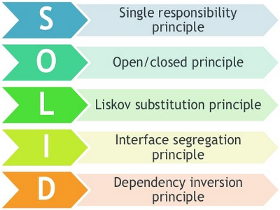

   

  &nbsp;

  &nbsp;
  &nbsp;
  

 

# Índice

- [O que é SOLID?](#📌-o-que-é-solid)
- [Conceito Single Responsibility Principle](#📌-conceito-single-responsibility-principle)
- [Conceito Open Closed Principle](#📌-conceito-open-closed-principle)
- [Conceito Liskov Substitution Principle](#📌-conceito-liskov-substitution-principle)
- [Conceito Interface Segregation Principle](#📌-conceito-interface-segregation-principle)
- [Conceito Dependency Inversion Principle](#📌-conceito-dependency-inversion-principle)

 

## 📌 O que é SOLID?

SOLID é um acrônimo dos princípios da programação orientada a objetos descritas por Robert C. Martin ("Uncle Bob")

- Auxiliam o programador a escrever **códigos** mais **limpos**, **facilitando** a **refatoração** e estimulando o **reaproveitamento do código**.

  

## 📌 Conceito Single Responsibility Principle

"A class should have one, and only one, reason to change."

- Uma classe deve ter um, e somente um, motivo para mudar
- A classe deve possuir uma **única responsabilidade** dentro do software.

## 📌 Conceito Open Closed Principle

"You should be able to extend a classes behavior, without modifying it."

- Você deve poder estender um comportamento de classe, sem modificá-lo.
- Objetos devem estar **abertos para extensão**, mas **fechados para modificação.**
- Quando novos comportamentos precisam ser adicionados no software, **devemos estender e não alterar o código fonte original**.

## 📌 Conceito Liskov Substitution Principle

"Derived classes must be substitutable for their base classes."

- Classes derivadas devem ser substituíveis por suas classes base.
- O princípio da substituição de Liskov foi introduzido por Barbara Liskov em 1987: "Se para cada objeto **o1** do **tipo S** há um objeto **o2** do **tipo T** de forma que, para todos os **programas P,** o comportamento de **P** é inalterado quando **o1** é substituído por **o2**, então **S é um subtipo de T**."

## 📌 Conceito Interface Segregation Principle

"Make fine grained interfaces that are cliente specific."

- Faça interfaces refinadas que são específicas do cliente.
- Uma classe **não deve** ser forçada a **implementar** interfaces e **métodos** que **não serão utilizados**.
- É melhor criar **interfaces** mais **específicas** ao **invés de** termos uma única **interface genérica**.

## 📌 Conceito Dependency Inversion Principle

- "Depende on astractions, not on concretions." (Dependa de abstrações e não de implementações.)
- Um módulo de alto nível não deve depender de módulos de baixo nível, ambos devem depender da abstração.
- PS: Inversão de Dependência **não** é igual a Injeção de Dependência.
